# **kCalApp**

kCalApp is a mobile nutrition tracking app built to make daily calorie and macro tracking simple, visual, and actually usable. Instead of overwhelming the user with data, the app focuses on a clean interface and quick logging, while still giving meaningful insights into daily nutrition.

kCalApp is a **full-stack mobile application**, with a **React Native frontend** and a **FastAPI backend** that integrates real-world nutrition data.

---

## **Overview**

The goal of kCalApp is to reduce friction in tracking food intake. Most nutrition apps are either too cluttered or too slow to use consistently. This app focuses on:

- Fast food search and logging  
- Clear macro and calorie breakdowns  
- A visual representation of daily progress  
- Simple navigation between days  

---
## 📱 Screenshots

### Home Dashboard
<p align="center">
  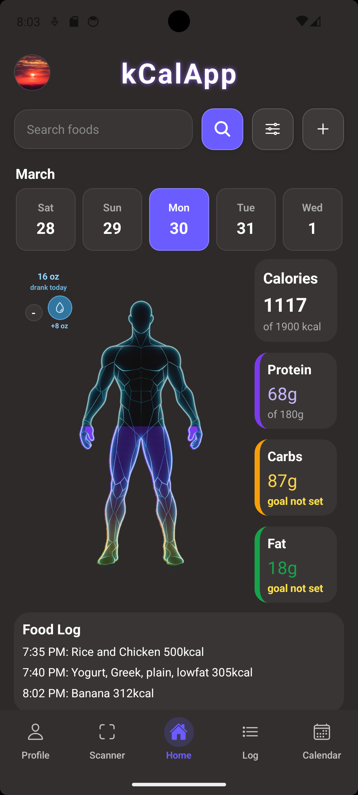
</p>

### Food Log
<p align="center">
  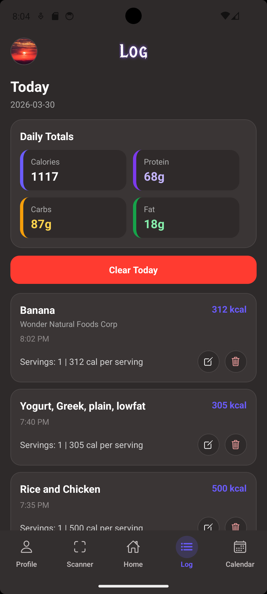
</p>

### Calendar Navigation

<p align="center">
  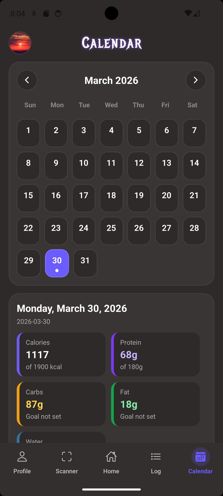
  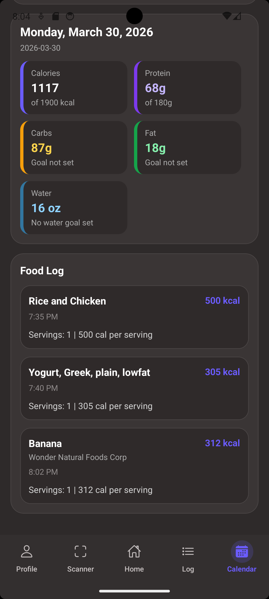
</p>

### USDA Food Search
<p align="center">
  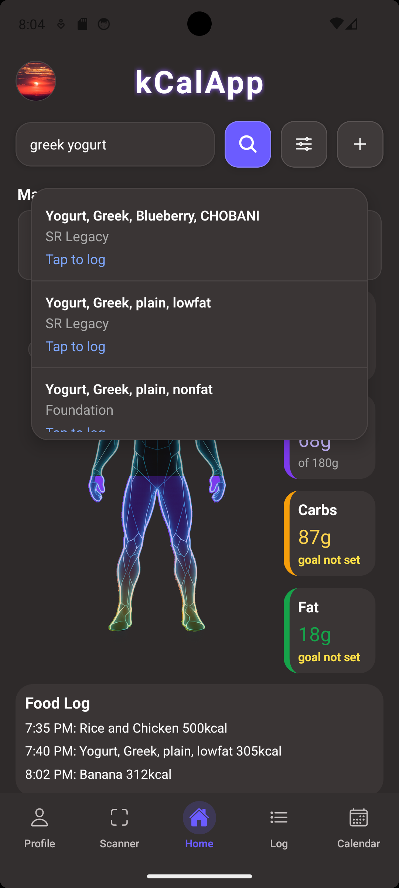
</p>

### Profile & Goals

<p align="center">
  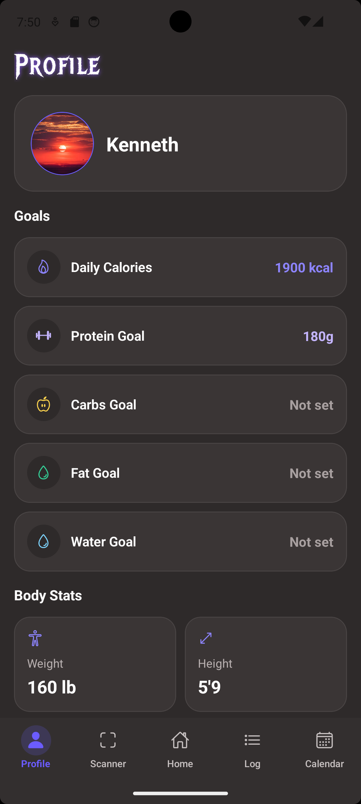
  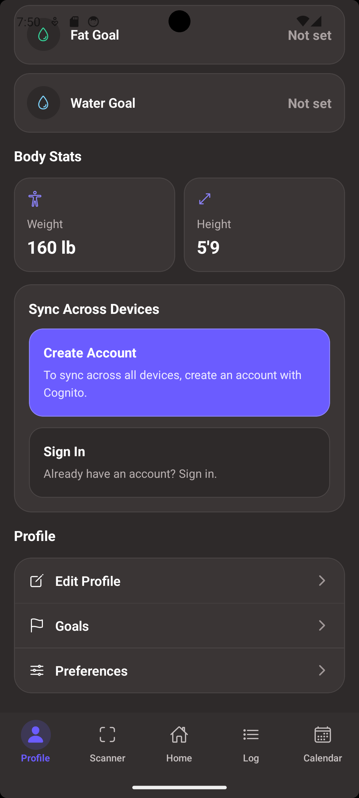
  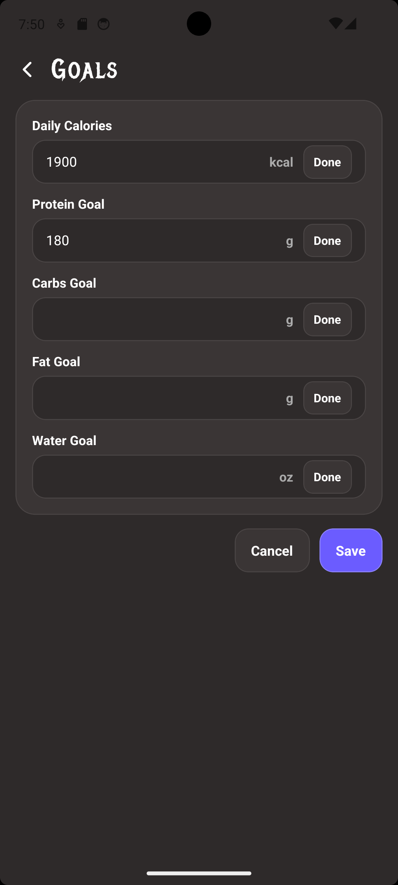
</p>

### Nutrition Scanner

<p align="center">
  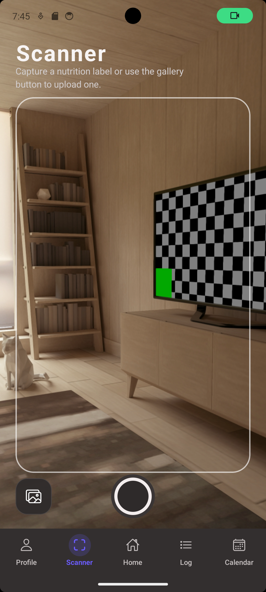
  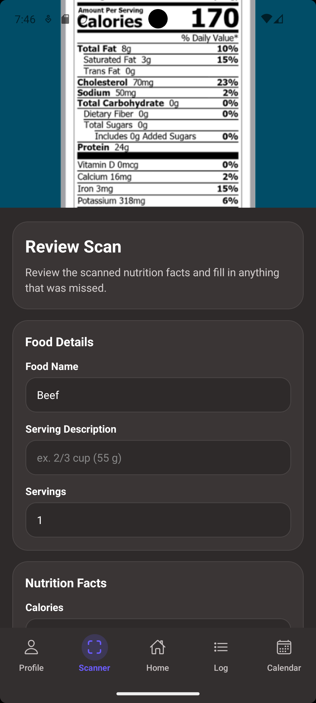
  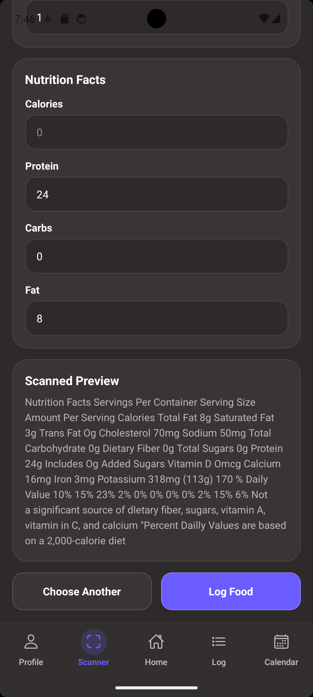
</p>

## **Tech Stack**

### **Frontend**
- React Native (Expo)  
- TypeScript  
- AsyncStorage (local persistence)  

### **Backend**
- FastAPI (Python)  
- REST API architecture  
- Pydantic for request validation  

### **Data**
- USDA FoodData Central API (nutrition data)  

---

## **Features**

### **Nutrition Label Scanner**
Scan a nutrition label using the camera or upload a photo from your gallery. The app extracts calories and macros automatically, with editable fields for quick and flexible logging.

---

### **Food Search and Logging**
Search for foods using real USDA data. Results appear instantly, and selecting an item logs it directly into the current day.

---

### **Editable & Removable Food Logs**
Each logged entry can be edited or removed at any time. Users can adjust nutrition values, servings, or names without affecting the original data source.

---

### **Nutrition Tracking**
Track daily intake of:
- Calories  
- Protein  
- Carbohydrates  
- Fat  

Totals update in real time as food is added or modified.

---

### **Visual Macro Breakdown**
A custom body-based visualization fills dynamically based on calorie intake, segmented by macros to provide an intuitive overview of nutritional balance.

---

### **Daily Food Log & Calendar**
Food entries are stored locally and organized by day. A horizontal calendar allows users to:
- Navigate between dates  
- View past logs  
- Track consistency over time  

---

### **Dynamic Goal Feedback**
The app responds to user progress visually. For example, calorie values turn red when daily goals are exceeded.

---

### **Manual Food Entry**
Users can manually log meals when a food is not available in the database.

---

### **Water Tracking**
Track daily water intake alongside nutrition for a more complete view of health.

---

## **Data Flow (How It Works)**

### Food Search Flow
1. User searches for a food  
2. Frontend sends request to FastAPI backend  
3. Backend queries USDA API and formats the response  
4. User selects a food → details are fetched  
5. App creates a structured log entry  
6. Entry is stored locally using AsyncStorage  
7. UI updates totals and visualization instantly  

---

### Nutrition Scanner Flow
1. User captures a nutrition label or uploads an image  
2. OCR extracts raw text from the label  
3. App parses calories and macro values  
4. User reviews and edits the extracted data  
5. A new log entry is created and stored locally  
6. UI updates totals immediately  

---

### Profile & Goals Flow
1. User sets calorie and macro goals  
2. Goals are stored locally  
3. Home screen compares consumed values vs goals  
4. UI updates dynamically (e.g., calories turn red when exceeded)  

---

### Local vs Cloud Data
- By default, all data is stored locally using AsyncStorage  
- Users can optionally sign in with AWS Cognito  
- Cloud sync is planned for future integration with DynamoDB  
  
---

## **Running the Project**

### **Backend**
```bash
cd backend
uvicorn src.api.app:app --reload --host 0.0.0.0 --port 8000
```

### **Frontend**
```bash
cd mobile
npx expo start
```

Make sure your frontend is pointing to your **local backend (LAN IP)** when testing on a physical device.
